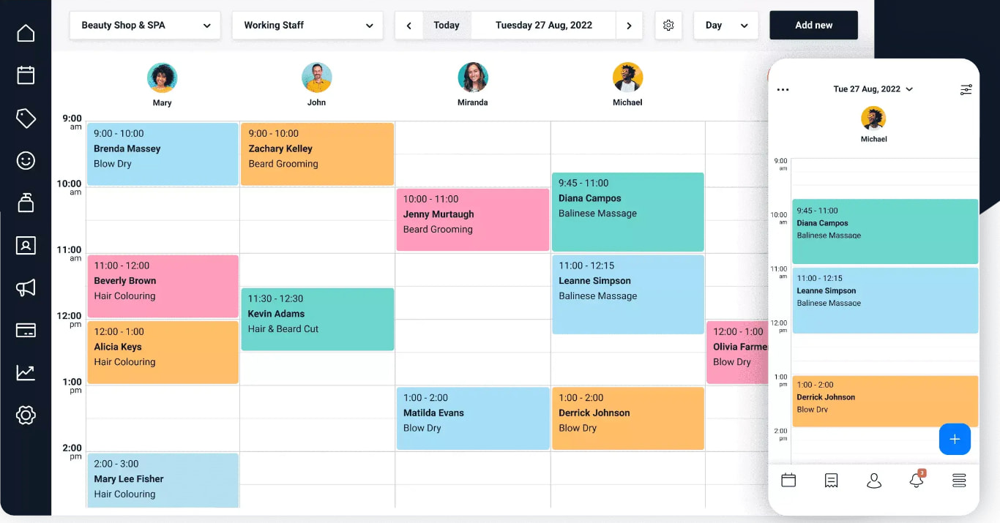

# Bookit

A full booking solution to manage and grow your business.
Packed with all the tools you need to boost sales, manage your calendar and
retain clients so you can focus on what you do best.

## Setup Dev Environment

This project need a database and two web server, one for the python API and the
second one for the nginx web server that displays the frontend.

Firstly you need to create a `.env` file with all the settings you prefer.
An easy way to do it is to just copy the demo file:

```bash
cp .env_demo .env
```

All these containers are provisioned using docker. To start the dev environment
just run:

```bash
docker compose up -d
```

Your developer environment should be up and runing, check:

- API: http://127.0.0.1:8181/healthcheck/
- FrontEnd: http://127.0.0.1:8080/

**Usefull commands**:

- Turn on: `docker compose up -d`
- Turn off: `docker compose down`
- Migrations: `docker exec -it bookit-api dbmate --help`
- API Lint: `docker exec bookit-api pylint "*"`
- Container logs: `docker compose logs -f`

## Migrations

The project database is set up using
[Dbmate migrations](https://github.com/amacneil/dbmate), to execute the
migrations run:

```bash
docker exec -it bookit-api dbmate up
```

Any changes to the database should be provisioned using migrations. To
better understand now to create a new migration please follow the 
[Dbmate docs](https://github.com/amacneil/dbmate/blob/main/README.md)

## API

The python API is running on port `8181` so you can access it at:
`http://localhost:8181/`.

A health check endpoint is provided so that you can check if everything is
running smoothly: http://localhost:8181/healthcheck

## Frontend

The app frontend will run on port `8080`so you can access it at:
`http://localhost:8080/`.



## Contribute

If you want to contribute please check the [issues page](https://github.com/mariogarridopt/bookit/issues). There you will
find all the things we want to be done. Add your code to a branch/fork and
create a Pull Request.

If you think something should be done differently or have a new feature proposal
Do not create a Pull Request regarding code that is not linked to an issue.
